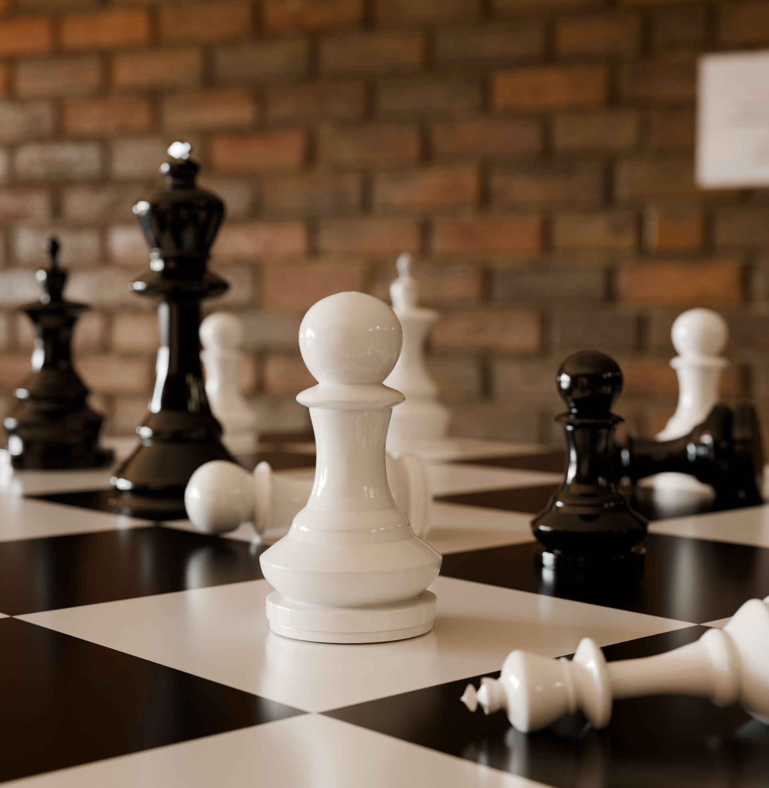

# Chess Board 3D Visualization

A realistic 3D chess scene created in **Blender**, focusing on physically based materials, cinematic lighting, depth of field, composition, and realistic rendering.

✨ Project Overview

This project focuses on creating a detailed chess scene in Blender while exploring realistic materials, cinematic lighting, depth of field, camera composition, and Cycles rendering. The scene was designed to improve product visualization and create a visually engaging 3D presentation.

🎨 Features

- ♟️ Detailed 3D chess board and chess pieces
- ✨ Physically based materials
- 💡 Cinematic lighting setup
- 🎥 Camera composition and framing
- 🔍 Depth of field
- 🌟 Realistic reflections and surface details
- 🖥️ High-quality Cycles rendering
- 🎨 Product-focused visual presentation

🛠️ Software Used

- Blender
- Cycles Render Engine
- Blender Modeling Tools
- Blender Material & Lighting Tools
- Blender Camera & Rendering Tools

🎯 Skills Practiced

3D Modeling • PBR Materials • Lighting • Camera Composition • Depth of Field • Product Visualization • Cycles Rendering • Realistic Rendering
